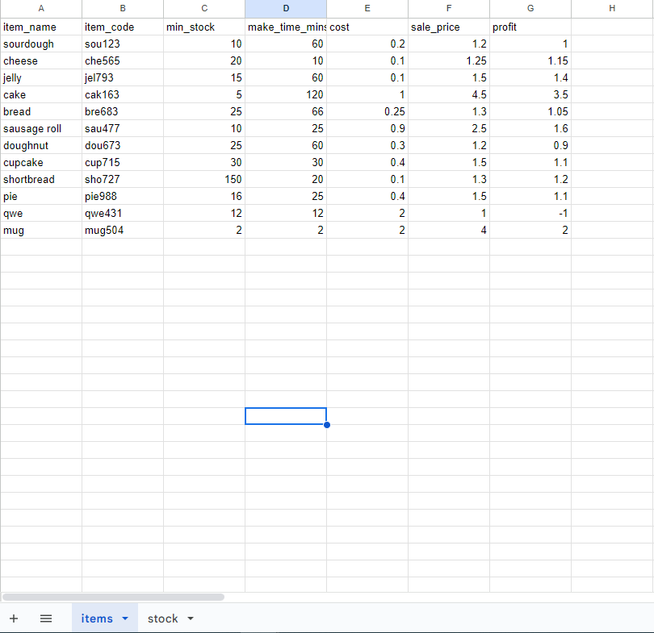

[Image source](https://www.unileverfoodsolutions.com.au/recipe/baguette-with-roasted-salmon-and-lime-chilli-mayonnaise-R0022179.html)

Program live link: The app has succesfully been deployed and can be viewed on <a href="https://subshop-ceb451619694.herokuapp.com/" target="_blank">Heroku</a>

Accompanying Spreadsheet: [Google Sheets](https://docs.google.com/spreadsheets/d/18cGqHrZWaSvZ3V6-gzhmV5peyCnDMR-ogmTHfpfYHII/edit#gid=0)

*Right/Middle click to open in a new tab*

---

## Contents
[Overview](#overview)
* Usage Scenario

[Google Sheets integration](#google-sheets-integration)

[Planning](#planning)

[UX](#ux)

[User Stories](#user-stories)

[Design Process](#design-process)
* API Integration
* Main Function

[Features](#features)
* Display Program Introduction

[Testing](#testing)
* User Stories Testing

[Validation and Version Control](#validation-and-version-control)

[Bugs and Known issues](#bugs-and-known-issues)
* Bugs
* Known Issues

[Project Outcome Summary](#project-outcomes-summary)

[Deployment](#deployment)

[Cloning and Forking](#cloning-and-forking)

[Technologies Used](#technologies-used)

[Future Ideas](#future-ideas)

[Credits](#credits)
---

## Overview

Welcome to the Subshop,

This app is a data-driven Python program which is integrated with Google Sheets. The aim is to boost efficiency in the store for daily tasks, by helping keep track of what is needed for the next day.

#### Usage Scenario

The planning for what is needed on any given day is done the night before. The store currently makes a fresh batch of stock at the minimum stock required level.

For efficieny and to reduce food waste, this tool will calculate the true predicted value for how much stock the user will need and it will help the store manage what products are selling well.

## Google Sheets integration
[Please refer to the program's accompanying spreadsheet](https://docs.google.com/spreadsheets/d/18cGqHrZWaSvZ3V6-gzhmV5peyCnDMR-ogmTHfpfYHII/edit#gid=0)

Stock plans are created by a manager each day. The Google Sheet serves to replicate 
this database. In the deployed program, the sheet uses "real-world" figures from 
the stores sales data. Figures are updated daily. In real-world deployment, 
the app would me modified to take sales data directly from the register to remove a 
stage of human input, creating an ongoing communication between the database and program.
However, this scenario has been simulated so a user can update at the end of the day.

The program refers to two sheets. An item and stock sheet which are updated depending on user inputs.

Items reference sheet

Stock reference sheet

It is important to note that the naming conventions in the worksheets must be followed, as the app relies on worksheet data and user inputs to function.

The item reference sheet contains data on each individual item for the program to address. Data such as the item name are integral to the program flow.

The items and stock sheet work on a wipe and reload basis. After a user updates their figures, the previous data will be overwritten. 

## Planning
Creating the program involved writing down on paper the columns in the sheet and how the main function would reference and update these.

Initially in planning, the tool was only going to accept new or update items. During the building phase, the decision to allow for deleting rows was also added.

## UX
The program flow is clear and asks the user for minimal information with minimal text. The program is designed to be simple to use and easy for the user to update the inventory.

## User Stories
### User goals:

* Add a new item to the subshop
* Update an item from the subshop
* Delete an item from the subshop

## Design Process
### API Integration:
Before writing any functions, I first had to setup any dependencies and test the API for Google Sheets integration. This required the libraries for gspread and google-auth.

Tests were made to confirm API function by printing vars made by gspread methods. See commit c60a69c (3rd commit of project)

After API integration was confirmed. I proceeded to test functions were able to extract the required data from the Google Sheet.
At this point I decided I also needed to add "*import pandas as pd* and *import numpy as np*"

### Main Function:

 My initial goal for this project was to have 2 sheets and 2 options. Entering a new item and updating an existing item. As I got into the programs development I decided to add a delete option, to remove entries from the database.
 
 When I was initially testing each function in the project, I was testing for correct values only. After completing the initial build, I realised that I also needed to add in validations and loops for when a user enters in blank spaces or incorrect values.

Flow Chart

## Features
This section will cover how and why each step in the program is included. The below will have screenshots in chronological order of output. Starting with the correct inputs for: new, update, delete. The validation messages will be shown in the validation testing section, found in the TESTING.md.

### Display Program Introduction

On program start, the user will be presented with the option to add a new item, update or delete an existing one. 

#### Add a new item:
The below screen shot is the options provided to the user to add a new item. In order, they will be asked to input:
* Product Name
* Minimum Stock Required
* Time taken to cook an item
* The cost to prepare the item
* How much the item sells for

Output: These inputs will be appended to the "items" tab and the "stock" tab in the worksheet.

#### Update an item
The below screen shot is the options provided to the user to update an item. In order, they will be asked to input:
* Product Name
* How many items sold
* Minimum Stock Required
* Time taken to cook an item
* The cost to prepare the item
* How much the item sells for

Output: The items row will be updated in the "stock" tab

#### Delete an item
The below screen shot is the options provided to the user to update an item. In order, they will be asked to input:
* Product Name

Output: This will delete the row requested, from both the "stock" and "items" tabs.

#### Final output

Regardless of which options are chosen. The user will see the current status of both sheets, as seen below:

#### Items table:

#### Stock table:

## Testing
All testing can be found in the [Testing file](TESTING.md)

## Validation and Version Control

By following best practice guidelines throughout development, my code has fully
passed through the [CI Python Linter](https://pep8ci.herokuapp.com/) with no errors found.
This can be verified by pasting the 'run.py' file through the CI Python Linter link:

## Bugs and Known issues
### Bugs
Testing was thorough during development as many bugs came up. Issues as follows:
* Columns being overwritten instead of rows being updated
* Data types not matching so the code would not run
* Incorrect user inputs breaking the code
* Blank spaces could be used as a user input

*All issues that were found and fixed before final deployment.*

### Known issues
There are no issues that have been found and are unresolved.

## Reminders

- Your code must be placed in the `run.py` file
- Your dependencies must be placed in the `requirements.txt` file
- Do not edit any of the other files or your code may not deploy properly

## Creating the Heroku app

When you create the app, you will need to add two buildpacks from the _Settings_ tab. The ordering is as follows:

1. `heroku/python`
2. `heroku/nodejs`

You must then create a _Config Var_ called `PORT`. Set this to `8000`

If you have credentials, such as in the Love Sandwiches project, you must create another _Config Var_ called `CREDS` and paste the JSON into the value field.

## Constraints

The deployment terminal is set to 80 columns by 24 rows. That means that each line of text needs to be 80 characters or less otherwise it will be wrapped onto a second line.