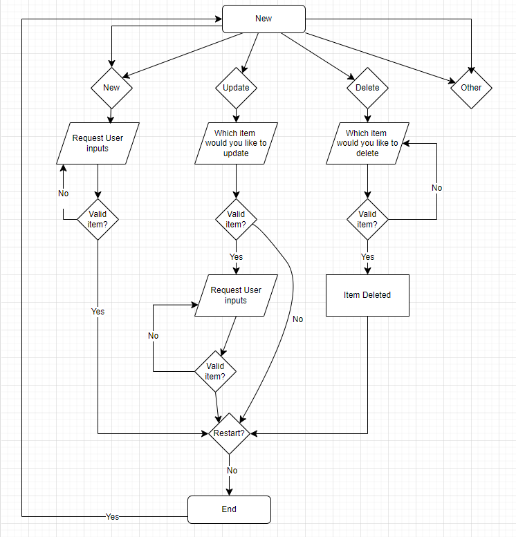

[Image source](https://www.unileverfoodsolutions.com.au/recipe/baguette-with-roasted-salmon-and-lime-chilli-mayonnaise-R0022179.html)

Program live link: The app has succesfully been deployed and can be viewed on <a href="https://subshop-ceb451619694.herokuapp.com/" target="_blank">Heroku</a>

Accompanying Spreadsheet: [Google Sheets](https://docs.google.com/spreadsheets/d/18cGqHrZWaSvZ3V6-gzhmV5peyCnDMR-ogmTHfpfYHII/edit#gid=0)

*Right/Middle click to open in a new tab*

---

# Contents
## [Overview](#overview)
* Usage Scenario

### [Google Sheets integration](#google-sheets-integration)

### [Planning](#planning)

### [UX](#ux)

### User Stories

### Design Process
#### API Integration
#### Main Function

### Features
#### Display Program Introduction

### Testing
#### User Stories Testing

### Validation and Version Control

### Bugs & Known issues

### Project Outcome Summary

### Deployment

### Cloning and Forking

### Technologies Used

### Future Ideas

### Credits
---

## Overview

Welcome to the Subshop,

This app is a data-driven Python program which is integrated with Google Sheets. The aim is to boost efficiency in the store for daily tasks, by helping keep track of what is needed for the next day.

#### Usage Scenario

The planning for what is needed on any given day is done the night before. The store currently makes a fresh batch of stock at the minimum stock required level.

For efficieny and to reduce food waste, this tool will calculate the true predicted value for how much stock the user will need and it will help the store manage what products are selling well.

## Google Sheets integration
[Please refer to the program's accompanying spreadsheet](https://docs.google.com/spreadsheets/d/18cGqHrZWaSvZ3V6-gzhmV5peyCnDMR-ogmTHfpfYHII/edit#gid=0)

Stock plans are created by a manager each day. The Google Sheet serves to replicate 
this database. In the deployed program, the sheet uses "real-world" figures from 
the stores sales data. Figures are updated daily. In real-world deployment, 
the app would me modified to take sales data directly from the register to remove a 
stage of human input, creating an ongoing communication between the database and program.
However, this scenario has been simulated so a user can update at the end of the day.

The program refers to two sheets. An item and stock sheet which are updated depending on user inputs.

Items reference sheet

Stock reference sheet

It is important to note that the naming conventions in the worksheets must be followed, as the app relies on worksheet data and user inputs to function.

The item reference sheet contains data on each individual item for the program to address. Data such as the item name are integral to the program flow.

The items and stock sheet work on a wipe and reload basis. After a user updates their figures, the previous data will be overwritten. 

## Planning
Creating the program involved writing down on paper the columns in the sheet and how the main function would reference and update these.

Initially in planning, the tool was only going to accept new or update items. During the building phase, the decision to allow for deleting rows was also added.

Flow Chart

## UX

## Reminders

- Your code must be placed in the `run.py` file
- Your dependencies must be placed in the `requirements.txt` file
- Do not edit any of the other files or your code may not deploy properly

## Creating the Heroku app

When you create the app, you will need to add two buildpacks from the _Settings_ tab. The ordering is as follows:

1. `heroku/python`
2. `heroku/nodejs`

You must then create a _Config Var_ called `PORT`. Set this to `8000`

If you have credentials, such as in the Love Sandwiches project, you must create another _Config Var_ called `CREDS` and paste the JSON into the value field.

Connect your GitHub repository and deploy as normal.

## Constraints

The deployment terminal is set to 80 columns by 24 rows. That means that each line of text needs to be 80 characters or less otherwise it will be wrapped onto a second line.

---

Happy coding!
